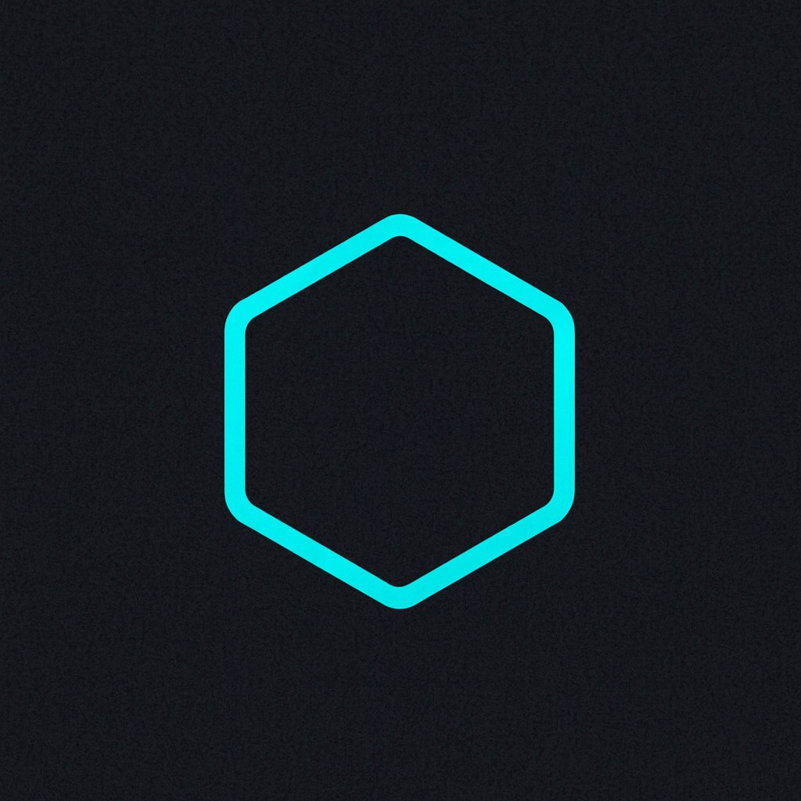

  

  <h1 align="center">Oxbit Labs</h1>

  

    <strong>Decoding the Future.</strong>
     
    The building block of digital logic.
  

  

    <a href="https://oxbitlabs.com"><strong>🌐 Website</strong></a> •
    <a href="#-our-ecosystem"><strong>🚀 Products</strong></a> •
    <a href="#-technology-stack"><strong>🛠 Tech Stack</strong></a> •
    <a href="#-contact"><strong>mailbox_with_mail: Contact</strong></a>
  

  

    
    
    
  

---

### 🧬 About Us

**Oxbit Labs** is a technology powerhouse dedicated to building robust, scalable, and efficient software solutions. Our name is derived from `0x` (the hexadecimal prefix representing the genesis of code) and `Bit` (the fundamental unit of data).

We specialize in bridging the gap between complex backend logic and seamless user experience across **MacOS**, **Web**, and **Blockchain** ecosystems. We don't just write code; we engineer solutions that stand the test of time.

### 🔭 Areas of Expertise

* **🍏 MacOS Native Development:** High-performance utilities and productivity tools tailored for the Apple ecosystem.
* **☁️ SaaS & Cloud Solutions:** Scalable web applications built on modern architectures.
* **🔗 Blockchain & Web3:** Decentralized logic, smart contracts, and DLT integrations.
* **🏢 Enterprise Software:** Secure and robust custom software for complex business needs.
* **🤖 AI & Automation:** Integrating Machine Learning to simplify daily workflows.

---

### 🚀 Our Ecosystem

We develop products that simplify the digital experience.

| Product | Description | Platform |
| :--- | :--- | :--- |
| <a href="https://www.xcleanerapp.com/"><strong>XCleaner</strong></a> | A pristine, lightweight optimization tool designed to keep your Mac running like new. Focused on clean code and performance. | `MacOS` |
| <a href="https://easyconvert.online/"><strong>EasyConvert</strong></a> | Fast, secure, and accessible file conversion tools specifically designed for web users. | `SaaS` |
| <a href="https://www.promptassist.online/"><strong>PromptAssist</strong></a> | AI-powered assistant tools to streamline communication and productivity workflows. | `AI / Web` |

---

### 🛠 Technology Stack

We believe in using the right tool for the job. Our core stack includes:

  
  
  
  
  
  
  

  
  
  

---

### 📫 Contact & Community

We are open to B2B partnerships and collaborative open-source contributions.

* **Website:** [oxbitlabs.com](https://oxbitlabs.com)
* **Inquiries:** `hello@oxbitlabs.com`
* **Location:** Global / Remote First

 

  
   
  © 2024-2025 Oxbit Labs. All rights reserved.   <i>Designed with logic, built for the future.</i>

